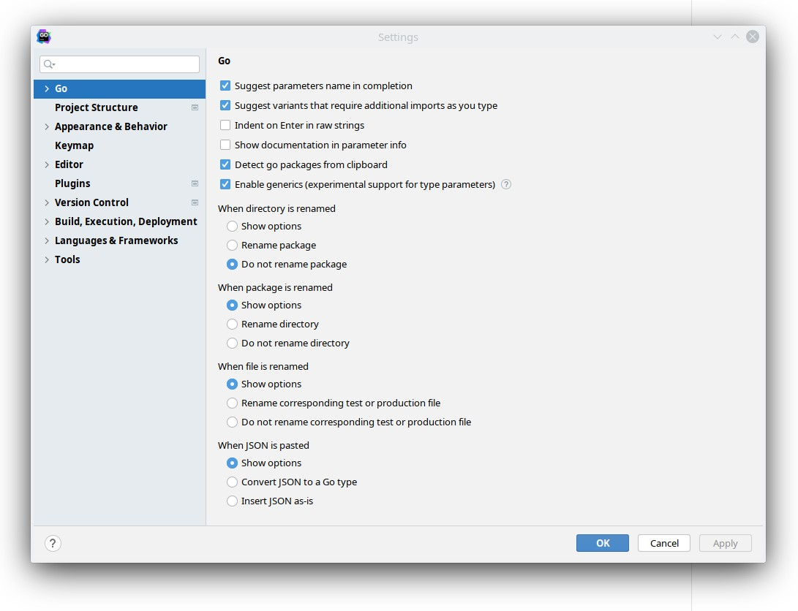
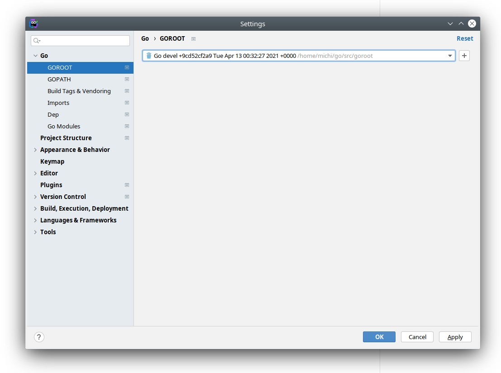

# go-functional-programming
Go functional programming

## Compile Go SDK

Generics will be added to go, but they are not yet supported. There is a tool that can be used to try out generics: go2go.

Clone the Go SDK:

```bash
$ git clone https://go.googlesource.com/go goroot
```

Check out the dev.go2go branch:

```bash
$ cd goroot
$ git checkout dev.go2go
```

Go to the `src` directory and compile everything:

```bash
$ cd src
$ ./all.bash
```

This will take some time.

## Configue GoLand

GoLand 2021.1 has experimental support for generics.

### Enable generics

Open the settings dialog with `Ctrl-Alt-S` or by selecting *File->Settings...* and select *Go*. Enable generics.



### Point GOROOT to the compiled SDK

Open the settings dialog, select *Go->GOROOT* and set it to the SDK that we have just compiled.


